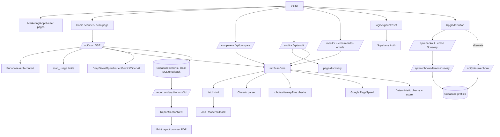
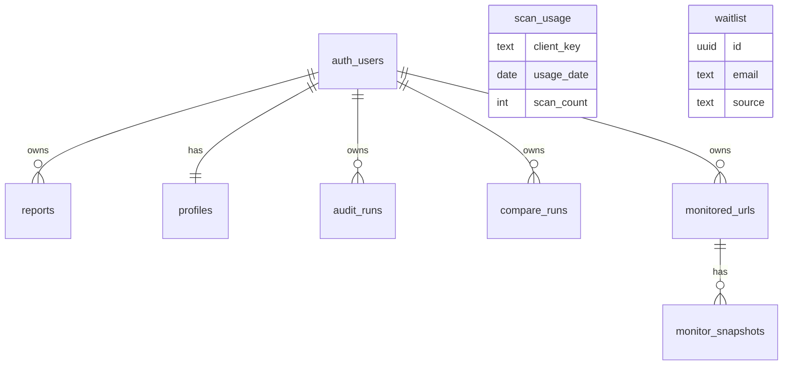

# AEOCheck Current State Audit

Discovery-only audit created from local repository evidence and live production checks on 2026-06-16. No fixes were implemented.

## 1. Executive Summary

AEOCheck is an existing production Next.js application, not a blank project. The current codebase is a Next.js App Router SaaS with public marketing pages, scanner/report flows, Supabase persistence, Supabase Auth, Lemon Squeezy checkout code, Polar webhook code, Resend emails, PageSpeed, multiple AI providers, comparison reports, multi-page audits, monitoring, admin views, blog/content pages, public SEO routes, and Vercel cron configuration.

Top confirmed findings:

| Priority | Finding | Evidence | Impact | Recommended Direction |
|---|---|---|---|---|
| Critical | Database migrations appear incomplete versus code expectations. | `supabase-schema.sql:1-55` defines `reports`, `profiles`, `scan_usage`; migrations add waitlist, monitor, audit, compare, portal URL only. Code references `plan_expires_at`, `welcome_email_sent`, `followup_email_sent`, `lemonsqueezy_subscription_id`, `retest_count`, `max_retests`, `webhook_events`, and `total_discovered` at `lib/auth-server.ts:24-35`, `lib/auth-server.ts:76-96`, `app/api/cron/followup-email/route.ts:37`, `app/api/reports/[id]/retest/route.ts:45-98`, `app/api/polar/webhook/route.ts:21-43`, `app/api/audit/route.ts:66-79`. | Auth, email, payments, retesting, audit creation, and webhook dedupe can fail in production if columns/tables are missing. | Confirm production schema and backfill migrations before feature changes. |
| High | Payments are split between Lemon Squeezy and Polar. | `.env.example:54-61` documents Polar only; `app/api/checkout/route.ts:6-87` creates Lemon Squeezy checkouts; `app/components/UpgradeButton.tsx:42-61` only accepts Lemon Squeezy URLs; `app/api/polar/webhook/route.ts:68-144` also handles Polar. | Monetization can be misconfigured, duplicated, or impossible to operate from `.env.example`. | Decide the active provider after verifying production env and webhook dashboard. |
| High | Scoring source of truth diverges between scan storage and report presentation. | Scan core computes `categoryScores` in `lib/scan-core.ts:63-90`; report ignores stored `categoryScores` and recalculates in `lib/report-category-scores.ts:38-81`; compare route has its own benchmark/category logic in `app/api/compare/route.ts:21-149`; PDF uses presentation props and fallback maps in `app/components/PrintLayout.tsx:283-322`. | Browser, PDF, and compare values can differ from persisted scan values. | Normalize one report presentation contract after discovery review. |
| High | README is stale and contradicts current app. | `README.md` says no auth/database/Stripe and Next.js 15; `package.json` has Next `^16.2.4`, Supabase, payments, auth, reports, dashboard. | Onboarding and deployment changes may be based on false assumptions. | Treat README as historical until rewritten. |
| Medium | Claims around AEO/GEO/citation impact are stronger than measured signals. | Copy claims cite likelihood and citation effects in `app/components/ReportSectionNew.tsx:110-126`, `public/llms.txt`, and blog content; scanner measures page-level proxies, not actual ChatGPT/Perplexity citation presence. | Trust and legal/product risk if users infer guaranteed citations. | Add transparent methodology and limitations before expanding claims. |
| Medium | Several routes/features are backend-only or client/session-only. | `/compare-report` reads `sessionStorage` in `app/compare-report/page.tsx:93-110`; `/api/analyze` is legacy authenticated JSON route using `lib/score.ts`; compare saves only for pro/agency in `app/api/compare/route.ts:204-218`. | Returning users may lose comparison reports; duplicated scan APIs increase maintenance risk. | Inventory which features are live product versus legacy. |

## 2. Current Technology Stack

| Area | Confirmed Current State | Evidence |
|---|---|---|
| Framework | Next.js `^16.2.4`, App Router | `package.json` |
| React | React/React DOM `^19.2.5` | `package.json` |
| TypeScript | TypeScript `^6.0.3`, strict enabled, `allowJs: true` | `package.json`, `tsconfig.json` |
| Node | Uses Node runtime routes and `node:sqlite`; exact production Node version not pinned | `app/api/*/route.ts`, `lib/report-db.ts:4` |
| CSS | Tailwind CSS v4 packages plus large custom global CSS | `package.json`, `app/globals.css` |
| UI/icons | `lucide-react`, `@phosphor-icons/react`, `@tabler/icons-webfont`; no shadcn detected | `package.json` |
| Auth | Supabase Auth via browser client and server token verification | `lib/supabase-browser.ts`, `lib/auth-server.ts:42-69` |
| Database | Supabase REST with service role; local SQLite fallback for reports | `lib/supabase-config.ts`, `lib/report-db.ts:21-68` |
| Payments | Lemon Squeezy checkout/webhook code; Polar SDK/webhook code; Polar env docs | `app/api/checkout/route.ts`, `app/api/webhooks/lemonsqueezy/route.ts`, `app/api/polar/webhook/route.ts`, `.env.example` |
| AI | DeepSeek, OpenRouter, Gemini, OpenAI provider chain | `.env.example:1-25`, `lib/ai-provider.ts:6-235` |
| PageSpeed | Google PageSpeed Insights API | `lib/pagespeed.ts:9-83` |
| Scraping/crawling | Native fetch, Cheerio, Jina Reader fallback | `lib/scrape.ts:88-154`, `package.json` |
| Blog/content | MDX files via `gray-matter`, `next-mdx-remote` | `lib/blog.ts`, `content/blog/*.mdx` |
| PDF/print | Browser print-based React `PrintLayout`; no PDF library dependency | `app/components/PrintLayout.tsx`, `app/components/ReportSectionNew.tsx:489-507` |
| OG images | `@vercel/og` edge routes | `app/api/og/route.tsx`, `app/api/logo/route.tsx` |
| Email | Resend contact/welcome/follow-up/monitor emails | `app/api/contact/route.ts`, `app/api/emails/welcome/route.ts`, cron routes |
| Analytics | GTM hard-coded `GTM-NJN4LTVJ`; no Vercel analytics package found | `app/layout.tsx:77-86`, `package.json` |
| Deployment | Vercel implied; `vercel.json` crons | `vercel.json` |
| Testing | One verification script only; no Jest/Playwright/Vitest deps | `scripts/verify-scan-runtime.mjs`, `package.json` |
| Rate limiting | Supabase `scan_usage` monthly counters plus in-memory AI cooldown | `lib/usage-limits.ts`, `app/api/scan/route.ts:14-33` |
| Caching | Next static generation for blog/vs, `revalidate=60` stats, static asset cache headers | `app/api/stats/route.ts`, `next.config.ts:61-72` |
| Background jobs | Vercel crons for monitor and follow-up email | `vercel.json:2-11` |

## 3. Architecture Diagram

## 4. Route and Feature Inventory

Major areas:

- Public marketing: `/`, `/pricing`, `/about`, `/team`, `/contact`, `/sample-report`, `/sitemap`, legal pages, comparison landing pages under `/vs/[competitor]`.
- Scan flow: homepage client scanner, `/scan`, `/api/scan`, loading UI, SSE events.
- Reports: `/report?id=...`, `/api/reports/[id]`, `ReportSectionNew`, `PrintLayout`, retest endpoint.
- Comparison: `/compare`, `/api/compare`, `/compare-report`, `/api/compare-history`, `/vs/*` static competitor pages.
- Audit: `/audit`, `/audit/[id]`, `/api/audit`, `/api/audit/[id]`, `/api/audit/[id]/scan`, `/api/audit/history`.
- Monitor: `/monitor`, `/api/monitor`, `/api/monitor/[id]`, history/scan endpoints, monitor email cron.
- Auth/account: `/login`, `/signup`, `/forgot-password`, `/reset-password`, `/auth/callback`, `/dashboard`, `/api/account`.
- Payments: `/api/checkout`, `/api/webhooks/lemonsqueezy`, `/api/polar/webhook`, `/upgrade/success`, `/upgrade/cancel`.
- Admin/internal: `/admin`, `/api/admin/summary`, `/api/admin/users`, `/api/health`.
- Content: `/blog`, `/blog/[slug]`, MDX content.

## 5. Scan Lifecycle

1. URL input and validation: client submits to `/api/scan`; server normalizes with `normalizeUrl` and `validateUrl` from `lib/scrape.ts:59-87`; private DNS/IP blocking runs via `validatePublicUrl` in `lib/url-safety.ts:14-43`; route code at `app/api/scan/route.ts:360-386`.
2. Authentication and limits: `getAuthContext` verifies Bearer token against Supabase at `lib/auth-server.ts:42-69`; usage key and monthly limit checked at `app/api/scan/route.ts:388-407`; monthly counters live in `lib/usage-limits.ts:17-117`.
3. Streaming setup: `ReadableStream` emits typed SSE progress/result/error events at `app/api/scan/route.ts:455-622`.
4. Page fetching: `runScanCore` starts at `lib/scan-core.ts:305`; first calls `fetchHtml` (`lib/scrape.ts:88-129`).
5. Fallback fetching: if HTML fetch fails, `scrapeUrlWithFallback` calls Jina Reader and `parseReaderTextToScrapedData` (`lib/scan-core.ts:105-113`, `lib/scrape.ts:130-203`).
6. Parsing: Cheerio parser extracts metadata, schema, headings, links, images, author/date/about/contact/readability in `lib/scrape.ts:347-538`.
7. Deterministic checks: `runDeterministicChecks` maps `CHECKS_CONFIG` in `lib/score-engine.ts:45-471`.
8. Robots/sitemap/llms: `checkRobotsTxt`, `checkSitemapXml`, AI bot parsing, and `llms.txt` fetch run in `lib/scan-core.ts:187-388`.
9. PageSpeed: `getPageSpeedScore` uses Google API in `lib/pagespeed.ts:9-83`; scan core maps CWV into `core_web_vitals` at `lib/scan-core.ts:392-456`.
10. Score calculation: weighted pass/warn/fail formula runs in `calculateScore` at `lib/score-engine.ts:474-493`.
11. AI analysis: if requested and not rate-limited, `buildAIPrompt` + `generateAIInsights` run via `app/api/scan/route.ts:235-293` and `app/api/scan/route.ts:526-568`.
12. AI grounding: schema and about/contact contradictions are corrected in `groundAIInsights` at `app/api/scan/route.ts:190-224`.
13. Competitors: optional competitor scans run through `scanCompetitor`, PageSpeed disabled, at `app/api/scan/route.ts:322-356` and `app/api/scan/route.ts:570-575`.
14. Persistence: `saveReportRecord` writes Supabase REST or local SQLite fallback at `lib/report-db.ts:70-123`.
15. Report rendering: `/report` fetches by id or session; `ReportSectionNew` renders normalized presentation.
16. PDF: gated browser print export via `ReportSectionNew.downloadPdf` and hidden `PrintLayout`, no server PDF generation (`app/components/ReportSectionNew.tsx:489-507`, `app/components/PrintLayout.tsx:283-646`).
17. Retesting: `/api/reports/[id]/retest` checks owner/unlock/pro status and returns URL/retest allowance; actual scan is then client-triggered (`app/api/reports/[id]/retest/route.ts:23-113`, `app/components/RetestButton.tsx`).
18. Comparison reports: `/api/compare` rescans two URLs and stores history only for pro/agency; `/compare-report` reads sessionStorage (`app/api/compare/route.ts:76-231`, `app/compare-report/page.tsx:93-110`).
19. Paywall: `canViewFullReport`/`canDownloadPdf` are based on plan or unlocked report state (`lib/access.ts:45-53`, `app/components/ReportSectionNew.tsx:302-315`).

## 6. Scan Check Inventory

| Check ID | Category | Source | Type | Weight | Applicability | Output |
|---|---|---|---|---:|---|---|
| title | Metadata | `lib/score-engine.ts:47` | Deterministic | 8 | All pages | title length pass/warn/fail |
| meta_desc | Metadata | `lib/score-engine.ts:66` | Deterministic | 8 | All pages | meta description length |
| h1 | Headings | `lib/score-engine.ts:85` | Deterministic | 8 | All pages | exactly one H1 |
| heading_structure | Headings | `lib/score-engine.ts:102` | Deterministic | 5 | All pages | H2/H3 hierarchy |
| schema_present | Schema | `lib/score-engine.ts:124` | Deterministic | 10 | All pages | any JSON-LD/microdata/RDFa type |
| faq_schema | Schema/AEO | `lib/score-engine.ts:138` | Heuristic | 10 | Warn only if FAQ-like content exists | FAQPage schema |
| article_schema | Schema/AEO | `lib/score-engine.ts:155` | Heuristic | 7 | Warn only if article/how-to signals exist | Article/HowTo/BlogPosting |
| og_tags | Metadata | `lib/score-engine.ts:180` | Deterministic | 6 | All pages | OG title/description |
| og_image | Metadata | `lib/score-engine.ts:200` | Deterministic | 4 | All pages | OG image present |
| https | Technical SEO/trust | `lib/score-engine.ts:213` | Deterministic | 8 | All pages | HTTPS URL |
| robots | Crawlability | `lib/score-engine.ts:226`, overridden `lib/scan-core.ts:187-233` | Fetch/API | 5 | Domain root | robots found |
| ai_bot_access | GEO/crawlability | `lib/score-engine.ts:241`, overridden `lib/scan-core.ts:327-363` | Heuristic | 8 | robots.txt body | GPTBot/ClaudeBot/PerplexityBot blocking |
| sitemap | Crawlability | `lib/score-engine.ts:256`, overridden `lib/scan-core.ts:234-276` | Fetch/API | 5 | Domain root/robots sitemap | sitemap exists and XML-shaped |
| llms_txt | GEO | `lib/score-engine.ts:270`, overridden `lib/scan-core.ts:365-388` | Fetch/API | 9 | Root `/llms.txt` | non-empty file |
| alt_text | Content clarity/accessibility | `lib/score-engine.ts:285` | Deterministic | 6 | Images only; no images pass | alt ratio |
| word_count | Content clarity | `lib/score-engine.ts:305` | Deterministic | 7 | All pages | 300+ pass, 150+ warn |
| internal_links | SEO/content | `lib/score-engine.ts:320` | Deterministic | 4 | All pages | internal link count |
| structured_density | Schema | `lib/score-engine.ts:336` | Heuristic | 5 | All pages | multiple relevant schema types |
| eeat_author | Trust/authority | `lib/score-engine.ts:359` | Heuristic | 7 | Warn mainly content-heavy pages | author/byline/person schema |
| eeat_about | Trust/authority | `lib/score-engine.ts:375` | Heuristic | 8 | All pages | linked About/Contact |
| eeat_freshness | Trust/authority | `lib/score-engine.ts:391` | Heuristic | 5 | All pages | dates <=12/24 months |
| readability | Content clarity | `lib/score-engine.ts:423` | Heuristic | 6 | Text pages | Flesch score |
| core_web_vitals | Performance | `lib/score-engine.ts:450`, overridden `lib/scan-core.ts:392-456` | PageSpeed API | 6 | PageSpeed available preferred | PageSpeed/CWV status |

## 7. Scoring Methodology

Overall score is confirmed as weighted percentage: pass earns full weight, warn earns 50%, fail earns 0%, rounded and clamped 0-100 (`lib/score-engine.ts:474-493`). There are no explicit global bonuses or caps beyond clamp. Missing PageSpeed leaves `core_web_vitals` as warn unless a score is returned (`lib/scan-core.ts:411-456`). AI failure does not affect deterministic score; it falls back to local recommendations (`app/api/scan/route.ts:526-568`).

Category scoring has two implementations:

- Scan core category scores: `checkScore` maps pass/warn/fail to 100/60/25 and averages grouped checks (`lib/scan-core.ts:57-90`).
- Report category scores: recalculates from checks and PageSpeed, includes `core_web_vitals` in performance, and caps schema display score at 45 when base schema is missing (`lib/report-category-scores.ts:22-81`).

Critical/high/nice issue severity is weight-derived: weight >=10 critical, >=7 high, >=4 medium, else low (`lib/report-issues.ts:14-29`). Core Web Vitals can split into synthetic issues `cwv_lcp`, `cwv_cls`, `cwv_tbt` (`lib/report-issues.ts:32-70`).

Homepage versus article-page rules are heuristic. `hasArticleContent` requires path/editorial/byline/date/long-form/procedural signals before Article/HowTo warning (`lib/score-engine.ts:16-33`). `/api/scan` separately suppresses AI Article recommendations unless `pageLooksEditorial` passes (`app/api/scan/route.ts:54-69`, `app/api/scan/route.ts:76-108`).

## 8. Browser/PDF/Compare Consistency

| Report Value | Canonical Source | Browser Consumer | PDF Consumer | Compare Consumer | Divergence Risk |
|---|---|---|---|---|---|
| Overall score | `calculateScore` in `lib/score-engine.ts:474` | stored `report.score` | stored `report.score` | `runScanCore.score` | Low |
| Category scores | ambiguous: scan stores `core.categoryScores`, report recalculates | `getReportPresentation` via `getResolvedReportCategoryScores` | `presentationData` from browser or fallback `getReportPresentation` | `/api/compare` uses scan-core category scores | High |
| Issues | checks + PageSpeed through `getNormalizedIssues` | `ReportSectionNew` normalizes and enriches | PDF receives browser-enriched issues or recalculates | Audit uses `getNormalizedIssues`; compare does not show issue list | Medium |
| Schema detected | scraper `schemaTypes` | `report.schemaTypes` preferred | `presentationData.schema.detected` or fallback | not included in compare response | Medium |
| Schema recommendations | AI grounded + browser heuristic fallback | browser `getSchemaRecommendation` can add suggestions | PDF receives browser-generated schema data | not included in compare | High |
| Passing checks | `getPassingChecks` filters optional schema when base missing | report presentation | PDF fallback or passed data | not used | Low |
| Performance | PageSpeed + `core_web_vitals` check | issue/category recalculation | same if passed | `/api/compare` category scores | Medium |

Confirmed divergence paths:

- `lib/scan-core.ts:63-90` and `lib/report-category-scores.ts:38-81` both compute category scores.
- `app/api/compare/route.ts:21-39` has its own `benchmarkMetrics`, separate from report categories.
- `app/compare-report/page.tsx:47-90` normalizes only metadata/schema/aiReadiness/performance for display.
- `app/components/ReportSectionNew.tsx:219-257` generates schema recommendations client-side even when AI is absent.
- `app/components/PrintLayout.tsx:38-84` has an older/fixed `FIX_MAP`, so PDF fix text may differ from browser fix text in `ReportSectionNew`.

## 9. AEO and GEO Methodology

Current inferred product definitions:

- AEO: page-level answer engine readiness, mainly metadata, schema, headings, answer-friendly content, trust, and performance.
- AI readiness: machine-readable clarity and extractability for AI assistants.
- GEO: AI crawler access, `llms.txt`, and citation/entity readiness language.
- Citation readiness: inferred from schema, crawlability, trust, readability, author/about/contact, and content clarity.
- Entity clarity: inferred from title/meta/H1/schema/about/contact/internal signals, not from a formal knowledge graph check.

Measured signals are mostly deterministic page proxies. Inferred signals include FAQ-like content, article-like page type, author detection, About/Contact detection, and AI crawler access from limited robots parsing. AI-generated signals are summary, content gap, quick win, recommendations, and schema reasoning. The app does not verify actual presence in ChatGPT, Perplexity, Google AI Overviews, or Copilot. Any claim that fixes increase citation probability should be framed as methodology-based, not guaranteed.

## 10. User Journey

Production evidence from live homepage confirms first-visit flow: scanner CTA, sample report, pricing, blog, FAQ, contact, footer links, and pricing cards are crawlable in the returned HTML. Live homepage copy states no signup/free scan and visible tiers at $0, $9, $19, $49.

Journey status:

- First-time visitor: clear homepage scanner and education; risk is strong claims around AI citations.
- Anonymous user: `/api/scan` allows guest scans with monthly/IP+UA key; live copy says no signup.
- Authenticated free user: dashboard/account APIs expose recent reports and remaining usage.
- Paid user: entitlement model exists, but payment provider state is unclear.
- Returning user: saved reports require Supabase; guest reports can be viewable by authenticated users per `app/api/reports/[id]/route.ts:26`.
- Competitor compare: `/compare` and `/compare-report` exist; report persistence is sessionStorage for public compare report.
- PDF export: browser-print PDF hidden behind paid access; no server-generated PDF.
- Retesting: gated by unlocked/pro/admin, uses report counters.

## 11. Report UX

Report experience includes hero score, category cards, action plan, issue list, schema analysis, AI answer snapshot, metadata, competitor panels, notes, PDF export, retest, copy summary, and upgrade modal (`app/components/ReportSectionNew.tsx`). It is feature-rich but high-risk for duplicated logic. Some visible strings in source show mojibake such as `—`, `✦`, and box-drawing comments, indicating encoding corruption in UI source/output risk.

Confirmed UX risks:

- Full report pricing in one report modal says Pro Monthly `$39/month` (`app/components/ReportSectionNew.tsx:1084`) while pricing page says Pro `$19/month`.
- Homepage/production pricing says $19; competitor pages say `$39/mo` in `app/vs/competitors.ts`.
- `llms.txt` says full report unlock `$14` while live/pricing code says `$9`.
- PDF is a browser print workflow, which may vary by browser and viewport.
- Compare report is lost if sessionStorage is cleared or opened in a new browser/session.

## 12. Database and Supabase

Simplified relationship diagram:

Tables confirmed in checked-in SQL:

- `reports`: id, user_id, url, score, result JSON, created_at; service role only; RLS enabled (`supabase-schema.sql:1-28`).
- `profiles`: id, email, plan, created/updated; service role only; RLS enabled (`supabase-schema.sql:30-40`).
- `scan_usage`: monthly usage keyed by client key and date; service role only (`supabase-schema.sql:42-55`).
- `waitlist`: anon/auth insert policy (`20260511_add_waitlist_table.sql`).
- `monitored_urls`, `monitor_snapshots`: user-owned RLS (`20260524_monitor.sql`).
- `audit_runs`: permissive policy includes anonymous `user_id IS NULL` (`20260525_audit.sql`).
- `compare_runs`: own select/insert policies (`20260529_compare_runs.sql`).
- `profiles.lemonsqueezy_portal_url`: only one payment-related profile migration (`20260529_portal_url.sql`).

Missing or unconfirmed schema:

- `profiles.plan_expires_at`, `profiles.welcome_email_sent`, `profiles.followup_email_sent`, `profiles.lemonsqueezy_subscription_id`.
- `reports.retest_count`, `reports.max_retests`, `reports.updated_at`, possible `polar_order_id`.
- `audit_runs.total_discovered`.
- `webhook_events`.

## 13. Authentication

Supabase client-side auth is used in `AuthContext` (`app/context/AuthContext.tsx`). Server routes expect a Bearer token and verify it with Supabase Auth (`lib/auth-server.ts:42-69`). Profiles are upserted on authenticated API access (`lib/auth-server.ts:61-69`). Login/signup/reset pages exist and are noindexed (`app/login/page.tsx`, `app/signup/page.tsx`, forgot/reset routes). OAuth callback exists at `/auth/callback`.

Risks:

- Protected routes rely on client state plus API auth; no middleware file was found in `rg --files`.
- Account deletion is mentioned in privacy policy but no account deletion API was found.
- Anonymous-to-authenticated report ownership transition is not fully confirmed; reports can have null `user_id`.
- Welcome/follow-up email flags may fail without missing columns.

## 14. Payments and Monetization

Current active UI path appears Lemon Squeezy:

- `UpgradeButton` posts to `/api/checkout`, requires auth token, validates checkout hostname ends with `lemonsqueezy.com` (`app/components/UpgradeButton.tsx:42-61`).
- `/api/checkout` uses Lemon Squeezy API and env vars `LEMONSQUEEZY_STORE_ID`, `LEMONSQUEEZY_API_KEY`, `LEMONSQUEEZY_VARIANT_*` (`app/api/checkout/route.ts:6-87`).
- Lemon webhook verifies `x-signature` and patches profile plan/subscription/portal fields (`app/api/webhooks/lemonsqueezy/route.ts:19-116`).

Polar is also present:

- `.env.example` documents Polar variables but not Lemon Squeezy variables.
- `@polar-sh/*` packages are installed.
- `/api/polar/webhook` validates Polar webhook signatures, unlocks reports for `order.paid`, and updates pro subscription status (`app/api/polar/webhook/route.ts:68-144`).

Status: partially working / ambiguous. Checkout flow can only work if production env has Lemon Squeezy variables despite `.env.example` omitting them. Polar webhook can only work if Polar checkout creation exists elsewhere; no active Polar checkout route was found.

## 15. Current SEO Status

Production-live confirmed:

- Homepage HTML is crawlable and includes major content sections, pricing, FAQs, footer links, and comparison links.
- `robots.txt` is live, allows public routes and AI crawlers, disallows dashboard/report/login/signup/api.
- `sitemap.xml` is live and lists homepage, pricing, blog, about, team, contact, sample report, sitemap, legal, comparison pages, and 11 blog posts.
- `llms.txt` is live and detailed, but stale pricing.
- Apex `https://aeocheck.co/` returns 301 (redirect target not fully printed by PowerShell output, but status confirmed).

Repository SEO:

- Canonicals through `buildPageMetadata` (`lib/seo.ts:21-58`).
- Homepage metadata in `app/layout.tsx:13-47` and `app/page.tsx`.
- Blog index/post metadata and article schema in `app/blog/page.tsx` and `app/blog/[slug]/page.tsx:27-135`.
- Report pages are noindexed (`app/report/page.tsx:19-65`).
- Dashboard/login/signup/compare-report are noindexed (`app/dashboard/page.tsx`, `app/login/page.tsx`, `app/signup/page.tsx`, `app/compare-report/layout.tsx`).

## 16. Current AEO Status

Confirmed strong implementation:

- Homepage has direct definitions, Q&A, scanner methodology copy, FAQ schema, HowTo schema, SoftwareApplication schema, Organization/WebSite/WebPage schema (`app/components/SchemaMarkup.tsx`).
- Blog posts use BlogPosting, BreadcrumbList, and optional FAQPage schema (`app/blog/[slug]/page.tsx:90-135`).
- `llms.txt` exists and is live.
- Robots explicitly allow major AI crawlers.

Weak implementation:

- Some methodology claims are not backed by visible source citations or disclosed limitations.
- Definitions of AEO/GEO sometimes blur together; one blog FAQ says GEO is another term for same concept, while product requires distinction.
- Sample report/methodology route exists, but no dedicated transparent scoring methodology page was found beyond sample report and copy.

## 17. Current GEO Status

Confirmed:

- `llms.txt` live with key pages and checks.
- Robots allow GPTBot, ChatGPT-User, Google-Extended, PerplexityBot, ClaudeBot, anthropic-ai.
- Brand entity info is consistent in Organization schema and About page.
- Author is visible on blog templates; blog schema uses Person `Ummar Ahmed`.

Weak/missing:

- Public content has limited citations to primary sources; homepage has one Google Search Central link in FAQ.
- Editorial policy, methodology limitations, data provenance, and update policy are not clearly centralized.
- `llms.txt` pricing is stale.
- No live AI-search citation validation is performed.

## 18. Content and Keyword Inventory

Public route/content clusters:

| Route/Page | Primary Intent | Cluster | Status |
|---|---|---|---|
| `/` | free AEO scanner / AI visibility scanner | product | strong but claim-heavy |
| `/pricing` | pricing | conversion | live, but pricing inconsistent elsewhere |
| `/sample-report` | methodology/report preview | product education | present |
| `/about`, `/team` | trust/entity | brand | present |
| `/contact` | support/contact | conversion/trust | present |
| `/vs/otterly`, `/vs/semrush-ai`, `/vs/peec-ai`, `/vs/profound` | competitor alternatives | BOFU comparison | present |
| `/blog/what-is-aeo-answer-engine-optimization` | what is AEO | beginner | present |
| `/blog/aeo-vs-seo` | AEO vs SEO | education | present |
| `/blog/free-aeo-checker` | free AEO checker | tool intent | present |
| `/blog/chatgpt-visibility-checker` | ChatGPT visibility checker | tool intent | present |
| `/blog/how-to-check-website-visible-chatgpt-perplexity` | AI visibility checking | how-to | present |
| `/blog/why-chatgpt-is-not-citing-your-website` | troubleshooting citations | pain point | present |
| `/blog/best-aeo-tools-ai-search-visibility` | best AEO tools | comparison | present; title says 2025 while asset alt says 2026 |
| `/blog/aeo-checklist-webflow-developers` | Webflow AEO checklist | platform-specific | present; title says 2025 |
| `/blog/aeo-for-saas` | AEO for SaaS | vertical | present |
| `/blog/google-ai-overviews-organic-traffic` | AI Overviews traffic | thought leadership | present |
| `/blog/chatgpt-product-recommendations` | ChatGPT product recommendations | BOFU/education | present |

Gaps inferred from current map: scoring methodology, limitations, examples by CMS/industry beyond Webflow/SaaS, changelog, privacy/security for scanned URLs, and payment/plan help pages.

## 19. Security and Reliability

| Area | Classification | Evidence |
|---|---|---|
| URL normalization | partially handled | `normalizeUrl` strips whitespace and defaults HTTPS (`lib/scrape.ts:59-65`) |
| Basic localhost/private URL block | partially handled | `validateUrl` blocks common private hosts/IPs (`lib/scrape.ts:67-87`) |
| DNS/private IP SSRF block | partially handled | `validatePublicUrl` resolves A/AAAA and blocks private ranges (`lib/url-safety.ts:14-43`) |
| Redirect SSRF | risky | `fetchHtml` validates final `res.url` after fetch (`lib/scrape.ts:105`), but DNS validation of redirected target before fetch is not confirmed |
| HTML timeout | robust-ish | 12s AbortController (`lib/scrape.ts:88-129`) |
| HTML size limits | partially handled | checks `content-length > 2_000_000` and slices body text; no streaming cap if header absent (`lib/scrape.ts:119-128`) |
| Non-HTML URLs | partially handled | content-type check for `text/html` or `application/xhtml+xml` (`lib/scrape.ts:114-117`) |
| Cloudflare/JS-rendered pages | partially handled | Jina fallback exists; no browser rendering |
| Robots/sitemap | partially handled | limited redirect/manual parser, root candidates only (`lib/scan-core.ts:148-276`) |
| AI model failures | robust | caught and falls back (`app/api/scan/route.ts:235-293`, `526-568`) |
| PageSpeed throttling | partially handled | retries 5xx/429, timeout env (`lib/pagespeed.ts:15-83`) |
| DB failures | partially handled | report local SQLite fallback; many API routes return 500/503 |
| Duplicate scans | partially handled | usage count and AI cooldown; no report de-dupe |
| SSE disconnects | partially handled | cancel logs only; scan work may continue (`app/api/scan/route.ts:455-459`) |
| Rate limiting | partially handled | monthly Supabase counters, contact form in-memory/window likely; no global IP middleware |

## 20. Code Quality

Confirmed health concerns:

- Oversized components: `app/components/ReportSectionNew.tsx` ~1200 lines, `app/globals.css` >10k lines.
- Duplicate scoring/report logic across `lib/scan-core.ts`, `lib/report-category-scores.ts`, `app/api/compare/route.ts`, `lib/score.ts`, and PDF maps.
- Legacy `/api/analyze` route uses old `lib/score.ts` and `types/report.ts`, separate from `/api/scan`.
- Stale README.
- Encoding corruption appears in multiple TSX/CSS source outputs (`—`, `✦`, `→`, box drawing comments).
- Missing schema migrations relative to code.
- Hard-coded GTM ID in layout and hard-coded live `SITE_URL` in `lib/seo.ts`.
- Payment provider ambiguity.

High-risk files to modify:

- `app/api/scan/route.ts`
- `lib/scan-core.ts`
- `lib/score-engine.ts`
- `lib/report-category-scores.ts`
- `app/components/ReportSectionNew.tsx`
- `app/components/PrintLayout.tsx`
- `lib/report-db.ts`
- payment routes and migrations

## 21. Testing Status

Existing documented verification:

- `npm run verify:scan` runs `scripts/verify-scan-runtime.mjs`, requiring a local dev server at `http://127.0.0.1:3000` and scanning `https://www.aeocheck.co/`.

Not run:

- `npm run verify:scan`: not run because no local dev server was started and starting one would be outside the requested investigation-only scope.
- `npm run build`: not run because it would write build artifacts under `.next`, conflicting with the instruction not to modify/create generated files during discovery.
- No unit/integration/e2e test framework is declared in `package.json`.

Missing tests:

- score formula tests
- category consistency tests
- browser/PDF/compare parity tests
- SSRF/redirect tests
- PageSpeed failure tests
- AI provider failure/JSON grounding tests
- Supabase migration/API contract tests
- payment webhook tests
- SEO metadata route tests

## 22. Deployment Status

Confirmed:

- Vercel deployment is strongly implied by `vercel.json`, Vercel response headers in live apex check, and Next config.
- Vercel crons configured for `/api/cron/monitor-emails` weekly Monday 09:00 and `/api/cron/followup-email` daily 09:00 (`vercel.json:2-11`).
- Node runtime specified for most server APIs; OG/logo routes use edge.
- Headers include CSP, HSTS, X-Frame-Options, nosniff, referrer policy (`next.config.ts:31-72`).

Risks:

- Cron routes require secrets/env; `CRON_SECRET` is mentioned in comments but not `.env.example`.
- Serverless max durations: audit scan route has `maxDuration = 60`; monitor email has `maxDuration = 300`; `/api/scan` may do fetch+PageSpeed+AI+competitors in one request.
- Local SQLite fallback in production serverless is risky/non-persistent (`lib/report-db.ts:15-68`).
- Missing env docs for Lemon Squeezy.
- Supabase service role is used server-side only, good, but many routes depend on schema not fully represented in migrations.

## 23. Live Site vs Repository Differences

Confirmed matching:

- Live robots.txt matches `app/robots.ts`.
- Live sitemap contents match `app/sitemap.ts` route inventory and current blog files.
- Live homepage content matches repository homepage structure and pricing sections.
- Live `llms.txt` exists and matches `public/llms.txt`.

Confirmed differences/drift:

- Live/home/pricing advertise $9 Full Report and $19 Pro, while `public/llms.txt` says $14 full report and no Pro price; some competitor pages say `$39/mo`; report modal says `$39/month`.
- README describes old MVP and does not match production.
- `.env.example` documents Polar but checkout is Lemon Squeezy.
- Production shell HTTP checks initially failed due sandbox, then succeeded after approval; browser console/mobile inspection was not performed.

## 24. Technical Debt

- Consolidate score/category/report presentation logic.
- Add/repair Supabase migrations for all referenced columns/tables.
- Remove or clearly mark legacy `/api/analyze` and `lib/score.ts`.
- Resolve Lemon Squeezy versus Polar provider direction.
- Fix stale pricing across `llms.txt`, schema, comparison pages, report modal, pricing page.
- Split oversized report component and CSS only after tests exist.
- Add methodology/limitations page and link it from reports.
- Replace sessionStorage-only compare report persistence with URL/report id if intended as saved feature.

## 25. Risks and Blockers

| Severity | Issue | Evidence | Affected Files/Routes | Business Impact | Technical Impact | Confidence | Status |
|---|---|---|---|---|---|---|---|
| Critical | Missing DB migrations | Code references columns/tables absent from SQL files | Supabase routes, auth, payments, retest, cron | Paid/user features may fail | 400/500 from Supabase REST | High | Confirmed in repo |
| High | Payment provider split | Lemon checkout + Polar webhook/env | `/api/checkout`, `/api/polar/webhook`, `.env.example` | Revenue flow risk | Misconfigured webhooks/env | High | Confirmed in repo |
| High | Score divergence | Multiple category/issue paths | reports/PDF/compare/audit | Trust erosion if values differ | Hard-to-debug inconsistencies | High | Confirmed |
| Medium | Strong GEO/AEO claims | Copy promises citation-like outcomes | public pages/report text | Trust/legal risk | Methodology mismatch | Medium | Inferred |
| Medium | Local SQLite fallback | `node:sqlite` fallback | `lib/report-db.ts` | Lost reports in serverless fallback | Non-persistent state | High | Confirmed |
| Medium | Encoding corruption | Mojibake in source outputs | UI/PDF/report files | Unpolished UX | Hard-to-read source | High | Confirmed |

## 26. Quick Wins

Discovery-only recommendations, not an implementation plan:

- Verify production Supabase schema against referenced columns/tables.
- Decide and document the active payment provider.
- Align prices in `public/llms.txt`, schema, pricing page, competitor pages, report modal.
- Mark README stale or replace after human review.
- Add a short public methodology/limitations note before making more GEO claims.

## 27. Medium-Term Opportunities

- Create one report presentation adapter consumed by browser/PDF/compare.
- Add score/category snapshot tests.
- Persist compare reports with IDs instead of sessionStorage.
- Add Supabase migration coverage and a migration verification script.
- Add server-side route tests for URL safety, PageSpeed failure, AI failure, payments, and webhooks.

## 28. Major Strategic Opportunities

- Turn sample report/methodology into a crawlable trust asset.
- Build a transparent “what we measure vs what we infer” page.
- Separate AEO, GEO, citation readiness, and AI visibility methodology clearly.
- Add original aggregate data from scans if privacy permits.
- Create productized audit/monitor workflows only after schema/payment foundations are confirmed.

## 29. Unknowns Requiring Human Confirmation

- Which payment provider is live in production: Lemon Squeezy, Polar, both, or migrating?
- Actual Supabase production schema and whether missing migrations were applied manually.
- Whether `/api/analyze` is still used by any external client.
- Whether reports are intended to be shareable publicly or only authenticated.
- Whether paid “one-time” means one report, full account plan, or specific URL unlock.
- Whether Pro price is $19 or $39.
- Whether full report unlock is $9 or $14.
- Whether current production deployment exactly matches this repository commit.
- Whether GTM/analytics ownership and consent requirements are complete.

## 30. Recommended Next Discovery Steps

Before planning improvements:

1. Review this audit manually and confirm payment provider, prices, and active product tiers.
2. Export or inspect production Supabase schema and compare against migrations.
3. Run the existing verification script on a local dev server only after approving generated `.next`/runtime writes.
4. Inspect production browser flows visually: scan, report, checkout, login/signup, dashboard, compare, PDF, retest, monitor.
5. Confirm whether legacy routes should remain supported.

### Feature Status Table

| Feature | Status | Files | Live? | Risk | Notes |
|---|---|---|---|---|---|
| Free scan | partially working | `/api/scan`, homepage | yes | Medium | usage/schema/env dependencies |
| Authenticated scans | partially working | `AuthContext`, `/api/account`, `/api/scan` | likely | Medium | Supabase required |
| Scan limits | partially working | `lib/usage-limits.ts` | likely | Medium | monthly env names differ from `.env.example` daily names |
| Saved reports | partially working | `lib/report-db.ts`, `/api/reports/[id]` | likely | Medium | local fallback risky |
| Retesting | partially working | `/api/reports/[id]/retest`, `RetestButton` | unknown | High | columns missing from migrations |
| Comparison reports | partially working | `/api/compare`, `/compare-report` | yes/unknown | Medium | sessionStorage report |
| PDF reports | partially working | `PrintLayout`, report UI | unknown | Medium | browser print, no library |
| Payment | partially working | Lemon + Polar routes | unknown | High | provider split |
| Pricing | partially working | `/pricing`, homepage, schema, llms | yes | High | price drift |
| Unlock/paywall | partially working | `access.ts`, report DB, webhooks | unknown | High | provider/schema issues |
| Sample report | fully/partially working | `/sample-report` | yes | Low | not deeply inspected visually |
| Blog | fully working | `content/blog`, `/blog` | yes | Low | titles have date drift |
| SEO landing pages | fully/partially working | `/vs/*`, sitemap | yes | Medium | pricing claims drift |
| Account/dashboard | partially working | `/dashboard`, `/api/account` | unknown | Medium | Supabase columns |
| Email flows | partially working | Resend routes/crons | unknown | Medium | missing flags/env |
| Analytics | partially working | GTM in layout | yes | Medium | hard-coded, consent unknown |
| Admin tools | partially working | `/admin`, `/api/admin/*` | unknown | Medium | admin email/env dependent |
| Monitor | partially working | `/monitor`, monitor APIs/crons | unknown | Medium | migration exists |
| Multi-page audit | partially working | `/audit`, audit APIs | unknown | High | `total_discovered` missing migration |

### Public Route Inventory

| Route | Purpose | Rendering | Indexable | Canonical | Schema | Content Status |
|---|---|---|---|---|---|---|
| `/` | scanner/marketing | server + client | yes | yes | extensive homepage schema | strong |
| `/pricing` | pricing | server + client | yes | yes | FAQ in page metadata area | price drift |
| `/blog` | blog index | server | yes | yes | BreadcrumbList | good |
| `/blog/[slug]` | article | static params | yes | yes | BlogPosting/Breadcrumb/FAQ | good |
| `/about` | brand/trust | server | yes | yes | About schema | good |
| `/team` | founder/team | server | yes | likely | unknown | present |
| `/contact` | contact | server + form | yes | likely | unknown | present |
| `/sample-report` | sample report | server/client | yes | yes | unknown | important |
| `/sitemap` | HTML sitemap | server | yes | likely | none/unknown | present |
| `/privacy-policy` | legal | server | yes | yes | unknown | present |
| `/terms-of-service` | legal | server | yes | yes | unknown | present |
| `/refund-policy` | legal | server | yes | yes | unknown | present |
| `/vs/[competitor]` | comparison SEO | static params | yes | yes | WebPage/Breadcrumb/FAQ | present |
| `/report` | report view | server/client | noindex | yes with id | unknown | gated |
| `/compare-report` | session compare report | client | noindex | no | none | ephemeral |
| `/dashboard` | account | client | noindex | no | none | protected |
| `/login`, `/signup` | auth | client | noindex | no | none | present |
| `/audit`, `/monitor`, `/compare`, `/scan` | app tools | mixed | unknown/noindex not always confirmed | mixed | unknown | present |

### External Services Table

| Service | Purpose | Environment Variables | Fallback | Cost Risk | Failure Impact |
|---|---|---|---|---|---|
| Supabase | Auth, profiles, reports, usage, audit, monitor, compare | `SUPABASE_URL`, `SUPABASE_SERVICE_ROLE_KEY`, public anon vars | report local SQLite only; many APIs 503/500 | storage/API/auth | core app degraded |
| Lemon Squeezy | checkout/subscriptions | `LEMONSQUEEZY_*` not in `.env.example` | none | payments | checkout unavailable |
| Polar | webhook/unlock/subscriptions | `POLAR_*` | none | payments | webhook inactive/unlocks fail |
| DeepSeek | AI insights | `DEEPSEEK_API_KEY`, model | provider fallback/local | token spend | local recommendations |
| OpenRouter | AI insights | `OPENROUTER_*` | provider fallback/local | token spend | local recommendations |
| Gemini | AI insights | `GEMINI_API_KEY`, model | provider fallback/local | token spend | local recommendations |
| OpenAI | AI insights/legacy analyze | `OPENAI_API_KEY`, model | fallback/local | token spend | local recommendations |
| Google PageSpeed | performance/CWV | `GOOGLE_PAGESPEED_API_KEY`, timeout/retry | unavailable/warn | API quota | no performance score |
| Jina Reader | fallback page fetch | `JINA_API_KEY` optional | direct fetch only | API quota | blocked pages fail more often |
| Resend | contact/welcome/follow-up/monitor email | `RESEND_API_KEY`, `CONTACT_EMAIL` | skip/log | email spend | no emails |
| GTM/GA | analytics | hard-coded GTM ID | none | analytics | tracking absent/misconfigured |
| Vercel | hosting/crons/edge OG | project env/config | none | hosting/functions | production runtime |

## Additional Summary Tables

### Scan Check Inventory

See section 6 for the complete scan check inventory table with check ID, category, source, type, weight, applicability, and output.

### Scoring Source-of-Truth Map

| Report Value | Canonical Source | Browser Consumer | PDF Consumer | Compare Consumer | Divergence Risk |
|---|---|---|---|---|---|
| Overall score | `lib/score-engine.ts:474` | `ReportSectionNew` | `PrintLayout` | `/api/compare` | Low |
| Category score | No single source | `lib/report-category-scores.ts` | passed/recomputed | `lib/scan-core.ts` | High |
| Issue priority | `lib/report-issues.ts` | enriched in browser | passed/recomputed | audit only | Medium |
| Schema recommendation | AI + browser heuristic | browser | passed/fallback | none | High |
| Unlock/PDF access | `lib/access.ts` + report flags | browser | browser gated | none | Medium |

### Priority Findings

See Executive Summary table. The highest-priority confirmed blockers are database migration mismatch, payment provider split, scoring/report divergence, stale docs, and pricing/content drift.
